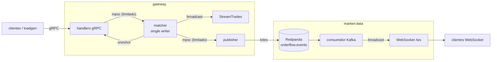

# orderflow-rs

[](https://github.com/icarojobs/orderflow-rs/actions/workflows/ci.yml)

Serviço de matching de ordens de baixa latência, orientado a eventos, escrito em Rust.

Um livro de ofertas em memória com prioridade preço-tempo fica atrás de uma API gRPC. Cada execução vira evento no Kafka (Redpanda), e um segundo serviço consome esses eventos e os distribui em tempo real por WebSocket. Tudo roda com `docker compose up`, com métricas Prometheus e traces OpenTelemetry.

## Arquitetura



| Crate | Tipo | Papel |
|---|---|---|
| `crates/engine` | lib | Livro de ofertas puro, sem I/O: ordens limitadas e a mercado, cancelamento, execuções parciais. |
| `crates/proto` | lib | Contrato gRPC `orderflow.v1` gerado com `tonic-prost-build` (`protoc` vendorizado). |
| `crates/events` | lib | Esquema JSON dos eventos e helpers de Kafka (conexão, criação de tópico, backoff). |
| `crates/telemetry` | lib | Logs JSON, exportação OTLP, recorder Prometheus, endpoints de operação e sinais. |
| `crates/gateway` | bin | API gRPC + task de matching + publisher Kafka. |
| `crates/market-data` | bin | Consumidor Kafka resiliente + fan-out por WebSocket. |
| `crates/loadgen` | bin | Gerador de carga gRPC com histograma HDR de latência. |

## Modelo de concorrência

**Um único escritor.** Todos os livros de ofertas pertencem a uma única task Tokio. Os handlers gRPC nunca tocam no livro: montam um `Command`, enviam por um `mpsc` limitado e aguardam a resposta num `oneshot`.

- **Sem locks no caminho quente.** Não há `Mutex`/`RwLock` em volta do livro; o motor é um `struct` comum com `&mut self`.
- **Ordem determinística.** A ordem de saída da fila é a sequência global da venue. Cada evento recebe um `sequence` monotônico.
- **Backpressure natural.** A fila é limitada (`GATEWAY_QUEUE_CAPACITY`). Se o matcher não acompanhar, os handlers esperam no `send` em vez de acumular memória sem limite.
- **Lotes.** O matcher drena até 256 comandos por wakeup (`recv_many`), o que amortiza o custo de agendamento sob carga.
- **Trace ponta a ponta.** O span do handler viaja junto com o comando, então o span `match` aparece dentro do trace `PlaceOrder` mesmo rodando em outra task. O tempo na fila (`orderflow_matcher_queue_wait_seconds`) é medido separado do tempo de matching (`orderflow_match_duration_seconds`).

**Saída de eventos, fora do caminho quente:**

- `broadcast` para os streams gRPC `StreamTrades`. Assinante lento recebe `Lagged` e pula eventos; não trava ninguém.
- `mpsc` limitado para o publisher Kafka, que envia em lotes de até 1024 registros. Aqui a escolha é a oposta: **backpressure em vez de perda**. Se o broker ficar lento, a fila enche e o matcher espera. Lotes que falham são reenviados na mesma ordem (at-least-once).

**Por que um escritor só e não um livro por thread?** Um livro de ofertas é inerentemente sequencial: cada ordem depende do estado deixado pela anterior. Paralelizar o matching de um mesmo símbolo exigiria lock ou coordenação que custa mais do que o próprio matching (média de ~2,4 µs por comando dentro do matcher, medida abaixo). O caminho para escalar é particionar por símbolo (um escritor por grupo de símbolos), não compartilhar o livro.

**Encerramento gracioso.** Em SIGTERM/Ctrl+C um `CancellationToken` para os servidores gRPC e HTTP e encerra os streams abertos. Os handles do matcher são liberados, a fila é drenada, o publisher esvazia o que falta para o Kafka e só então o processo sai com código 0. Com o broker fora do ar, o publisher desiste em vez de prender o processo e loga quantos eventos ficaram sem envio.

## Motor de matching (`engine`)

- Preço em ticks (`i64`) e quantidade em lotes (`u64`): nada de ponto flutuante.
- Níveis de preço em `BTreeMap` (bids pelo maior preço, asks pelo menor).
- Ordens do mesmo nível formam uma lista duplamente encadeada intrusiva dentro de um `Slab`, com índice `OrderId → slot`. Consumir a cabeça da fila e cancelar do meio são O(1) depois de achar o nível (O(log n) no número de níveis).
- A execução acontece sempre no preço do maker; ordens a mercado nunca ficam no livro (o saldo expira).

**Testes de propriedade (`proptest`)** geram sequências aleatórias de ordens limitadas, a mercado e cancelamentos e verificam, depois de cada comando:

- o livro nunca fica cruzado (`best_bid < best_ask`);
- conservação de quantidade: `enviado = 2 × negociado + em repouso + cancelado + expirado`;
- fills respeitam o limite do taker e consomem os melhores preços primeiro;
- o livro bate com um modelo de referência simples.

## API

gRPC em `:50051` (`proto/orderflow/v1/orderflow.proto`):

| RPC | Descrição |
|---|---|
| `PlaceOrder` | Ordem limitada ou a mercado. Retorna id, status (`RESTING`, `FILLED`, `EXPIRED`) e os fills. |
| `CancelOrder` | Cancela uma ordem em repouso. |
| `GetBook` | Profundidade agregada por nível (`depth`, padrão 10). |
| `StreamTrades` | Stream de trades do servidor, com filtro opcional por símbolo. |

Erros viram códigos gRPC: símbolo ou ordem inexistente → `NOT_FOUND`; quantidade ou preço inválidos → `INVALID_ARGUMENT`; servidor encerrando → `UNAVAILABLE`.

Eventos no tópico `orderflow.events` (JSON, chave = símbolo, uma partição para preservar a ordem global):

```json
{"type":"trade","symbol":"BTC-USD","sequence":2,"maker_order_id":1,"taker_order_id":2,"taker_side":"buy","price":100,"quantity":2,"timestamp_ns":1790551197694587564}
```

Tipos: `trade`, `order_accepted`, `order_cancelled`.

WebSocket do market-data: `ws://localhost:18081/ws` (tudo) ou `ws://localhost:18081/ws?symbol=BTC-USD`.

## Como rodar

Pré-requisito: Docker com Compose v2.

```bash
docker compose up -d --build --wait      # redpanda + gateway + market-data
curl localhost:18080/readyz               # gateway
curl localhost:18081/readyz               # market-data (pronto quando conectado ao Kafka)
```

Enviando ordens com [grpcurl](https://github.com/fullstorydev/grpcurl):

```bash
grpcurl -plaintext -import-path proto -proto orderflow/v1/orderflow.proto \
  -d '{"symbol":"BTC-USD","side":"SIDE_SELL","order_type":"ORDER_TYPE_LIMIT","price":100,"quantity":5}' \
  localhost:50051 orderflow.v1.OrderGateway/PlaceOrder

grpcurl -plaintext -import-path proto -proto orderflow/v1/orderflow.proto \
  -d '{"symbol":"BTC-USD","side":"SIDE_BUY","order_type":"ORDER_TYPE_MARKET","quantity":2}' \
  localhost:50051 orderflow.v1.OrderGateway/PlaceOrder
```

Acompanhando o fluxo:

```bash
websocat 'ws://localhost:18081/ws?symbol=BTC-USD'
docker compose exec redpanda rpk topic consume orderflow.events
```

Teste de carga:

```bash
docker compose --profile tools run --rm loadgen --orders 100000 --concurrency 64
```

Observabilidade (Jaeger em `:16686`, Prometheus em `:19090`):

```bash
OTEL_EXPORTER_OTLP_ENDPOINT=http://jaeger:4317 docker compose --profile observability up -d --wait
```

Testes e lint dentro de container (usa o UID do host e guarda o cache em `./target/docker`):

```bash
docker compose run --rm dev cargo test --workspace --locked
docker compose run --rm dev cargo clippy --workspace --all-targets -- -D warnings
```

Ou direto na máquina: `cargo test --workspace` e `cargo bench -p orderflow-engine`.

### Portas no host

| Serviço | Porta | Variável para trocar |
|---|---|---|
| gateway gRPC | 50051 | `GATEWAY_GRPC_PORT` |
| gateway HTTP (`/healthz`, `/readyz`, `/metrics`) | 18080 | `GATEWAY_HTTP_PORT` |
| market-data HTTP/WebSocket | 18081 | `MARKET_DATA_PORT` |
| Redpanda (Kafka externo) | 19092 | `REDPANDA_KAFKA_PORT` |
| Jaeger UI | 16686 | `JAEGER_UI_PORT` |
| Prometheus | 19090 | `PROMETHEUS_PORT` |

## Configuração

| Variável | Padrão | Serviço |
|---|---|---|
| `GATEWAY_GRPC_ADDR` | `0.0.0.0:50051` | gateway |
| `GATEWAY_HTTP_ADDR` | `0.0.0.0:8080` | gateway |
| `GATEWAY_SYMBOLS` | `BTC-USD,ETH-USD` | gateway |
| `GATEWAY_QUEUE_CAPACITY` | `65536` | gateway |
| `GATEWAY_DEFAULT_DEPTH` | `10` | gateway |
| `GATEWAY_PUBLISHER_CAPACITY` | `65536` | gateway |
| `GATEWAY_PUBLISHER_BATCH` | `1024` | gateway |
| `MD_HTTP_ADDR` | `0.0.0.0:8081` | market-data |
| `MD_START_FROM` | `latest` (ou `earliest`) | market-data |
| `MD_BUFFER` | `4096` | market-data |
| `KAFKA_BROKERS` | vazio (desliga o Kafka) | ambos |
| `KAFKA_TOPIC` | `orderflow.events` | ambos |
| `OTEL_EXPORTER_OTLP_ENDPOINT` | vazio (desliga o OTLP) | ambos |
| `RUST_LOG` | `info` | ambos |

## Resiliência do market-data

- **Reinício do broker:** o offset fica em memória; se o fetch falhar, o consumidor derruba a conexão, faz backoff exponencial com jitter e retoma do mesmo offset. Validado com `docker compose restart redpanda` no meio do fluxo.
- **Retenção:** `OffsetOutOfRange` pula para o offset mais antigo disponível.
- **Duplicatas e lacunas:** como o publisher é at-least-once, eventos com `sequence` já visto são descartados (`md_duplicates_total`) e lacunas são contadas (`md_sequence_gaps_total`).
- **Clientes lentos:** o JSON é serializado uma vez e compartilhado via `Arc`; o cliente que não acompanha pula eventos (`md_ws_lagged_total`) sem atrasar os demais.

## Resultados

Números medidos por mim, na minha máquina de desenvolvimento, com outros serviços rodando ao mesmo tempo. Servem como ordem de grandeza, não como benchmark controlado.

**Máquina:** Intel Core i7-10700 @ 2.90 GHz (8 núcleos / 16 threads, turbo até 4.8 GHz), 31 GiB de RAM, Linux 7.1.1, rustc 1.98.1, Docker 29.8.1.

### Motor (Criterion)

```bash
cargo bench -p orderflow-engine
```

| Benchmark | Tempo (estimativa central) | Observação |
|---|---|---|
| `submit/limit_resting` | 132 ns | ordem que não cruza e entra no livro (~7,5 M ops/s) |
| `submit/limit_crossing_single_fill` | 300 ns | executa contra um único maker, livro recém-criado a cada iteração |
| `submit/market_sweep_10_levels` | 6,77 µs | ordem a mercado varrendo 10 níveis, 100 fills |
| `cancel_mid_queue` | 261 ns | cancelamento no meio da fila de um nível |
| `mixed_flow/100k_orders` | 8,16 ms | 100 mil ordens (90% limitadas, 10% a mercado): **~12,3 M ordens/s** |

### Ponta a ponta (gRPC + matching + Kafka)

Stack completo no compose (Redpanda + gateway + market-data), com o loadgen rodando em outro container na mesma máquina. A latência é medida no cliente (ida e volta gRPC completa). Fluxo: 90% ordens limitadas em torno do preço médio, 10% a mercado, símbolo `BTC-USD`, 5.000 ordens de aquecimento fora da medição (2.000 no cenário com 1 cliente).

```bash
docker compose up -d --build --wait
docker compose --profile tools run --rm loadgen --orders 20000 --warmup 2000 --concurrency 1 --connections 1
docker compose --profile tools run --rm loadgen --orders 100000 --concurrency 64        # 3 execuções
docker compose --profile tools run --rm loadgen --orders 200000 --concurrency 256 --connections 8
```

| Cenário | Throughput | p50 | p90 | p99 | p99.9 |
|---|---|---|---|---|---|
| 1 cliente, 1 conexão | 10.017 ordens/s | 96 µs | 119 µs | 149 µs | 223 µs |
| 64 em voo, 4 conexões (execução 1) | 103.951 ordens/s | 567 µs | 925 µs | 1,39 ms | 2,00 ms |
| 64 em voo, 4 conexões (execução 2) | 109.436 ordens/s | 539 µs | 871 µs | 1,33 ms | 1,80 ms |
| 64 em voo, 4 conexões (execução 3) | 107.014 ordens/s | 549 µs | 892 µs | 1,40 ms | 2,23 ms |
| 256 em voo, 8 conexões | 146.188 ordens/s | 1,67 ms | 2,48 ms | 3,43 ms | 4,30 ms |

Nenhum erro em nenhuma execução. Ao fim das rodadas acima (542.000 ordens no total, contando o aquecimento), as métricas mostravam:

- 985.953 eventos publicados no Kafka pelo gateway e os mesmos 985.953 consumidos pelo market-data, com `md_consumer_lag = 0`;
- tempo médio **dentro do matcher** de ~2,4 µs por comando (`orderflow_match_duration_seconds`: soma de 1,318 s / 542.000), incluindo métricas, span e emissão de eventos;
- tempo médio **na fila** antes do matcher de ~197 µs (`orderflow_matcher_queue_wait_seconds`: soma de 106,65 s / 542.000). Ou seja, sob carga a latência é dominada por fila e rede, não pelo matching.

**Uma correção que os números mostraram:** a primeira rodada do loadgen tinha p50 abaixo de 1 ms, mas p99 perto de 41 ms, o padrão clássico de Nagle + delayed ACK. O gateway usa `serve_with_incoming_shutdown` com listener próprio e, nesse caminho, o tonic não aplica as opções de socket do builder. Ligar `TCP_NODELAY` em cada conexão aceita levou o p99 para ~2 ms e mais que dobrou o throughput (detalhes no PR #14).

## CI

GitHub Actions em cada PR: `cargo fmt --check`, `clippy -D warnings`, testes, compilação dos benchmarks, `cargo-deny` (advisories, licenças, fontes) e um job que builda as imagens, sobe o compose com `--wait` e faz smoke test nos endpoints de saúde.

## Limitações e próximos passos

- Estado só em memória: um restart perde o livro. O próximo passo seria um journal de comandos (ou snapshot + replay do tópico) para recuperação.
- Um escritor para todos os símbolos; escalar horizontalmente significa particionar símbolos entre instâncias e usar uma partição por símbolo.
- Sem autenticação, controle de risco ou self-trade prevention.
- O contexto de trace ainda não é propagado nos headers do Kafka até o market-data.

## Licença

MIT — veja [LICENSE](LICENSE).
